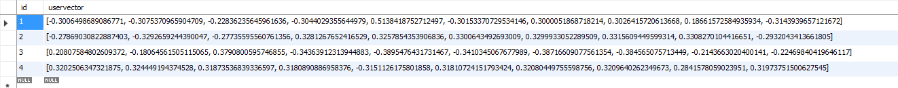
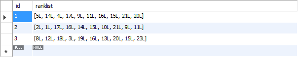

项目简介
======
基于TransE算法进行歌曲推荐的音乐平台，TransE算法根据用户已收藏歌曲推测用户可能喜欢的歌曲并向用户推荐，本仓库只上传项目中TransE相关代码供读者参考。

使用说明
======
### tranE.py

TranE为**训练程序**，使用时首先创建TransE类的实例。
TranE类__init__函数中各参数含义分别为：
- margin: 在更新向量时用到该变量，最佳取值尚不清楚，默认为1
- learningrate: 学习速率，由于未使用拟牛顿法，只能设置定值，默认为0.00001，学习速率越小，向量每次更新时改变越小
- dim: 实体与关系映射的向量空间的维数，默认为10维，即dim=10
- L1: 在计算向量距离时是否使用1-范数，默认为False，即使用2-范数

实例化TransE类后，调用其transE函数，函数的参数含义分别为：
- tn: 训练次数。由于每次训练都抽取sn个三元组训练，因此tn越大训练越充分，同时若learningrate很小，则每次训练向量该变量很小，需要更大的tn来充分训练
- sn: 每次训练随机抽取的三元组的数目，三元组即（用户，关系，音乐）组，从已收藏歌曲表中取出，设置此参数防止因为没有足够的三元组而报错

使用如下命令执行训练程序：
```angular2html
transe = tranE(margin, learingRate, dim, L1):
transe.transE(cI)
```
训练结果如图（图为训练后的10维用户向量）



### predict.py

predict为**预测程序**，使用时首先创建redict类的实例。
__init__函数中参数recoNum为为每个用户推荐的音乐的数量，默认为10首。
实例化TransE类后，调用predict函数，程序会将音乐的按推荐程度排序保存为列表写入数据库音乐推荐表中。

使用如下命令执行预测程序：
```angular2html
pre = Predict()
pre.predict()
```
预测结果如图（id为用户id，rankList中的数字为音乐id）


算法参考自《Translating Embeddings for Modeling Multi-relational Data》
